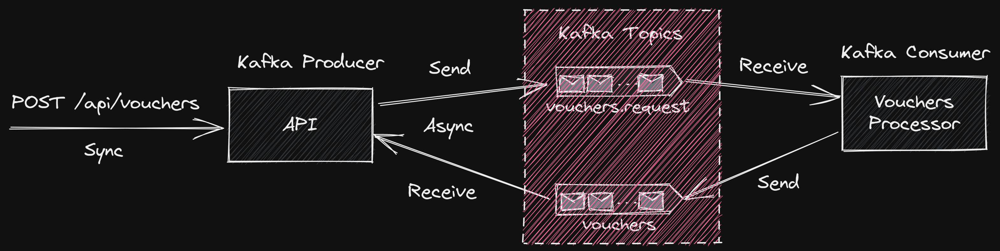

# Kafka Replying App
## Introduction
This is a concept implentation of request-response Pattern using Kafka. The app demonstrates exposing a RESTful API interface to receive request from clients and use the async/event driven architecture to process the request and provide response back to the clients. 

This would be useful in certain scenarios where the result of the operation/task is required to continue further, or in cases where a user journey expects a response to make it available to the end users. For instance, users has requested something and awaiting a response. The concept app considers the use case of issuing voucher codes via an API call.

## Pattern Implementation



The client makes an API call to a RESTful interface. The API publishes a request message to a Kafka topic which will be picked up by a kafka consumer to process the request. On completing the process, the consumer sends the reply in a Kafka topic which will be read by the API and provides response to the consumer. The API will wait for the maximum configured time to fetch the response from the Kafka topic. In case the response is not received within the configured timeout, the API will provide a non success (non HTTP 200) error status to the client.

This concept implementation is built with the following technologies:
- Java 17
- Spring Boot
- Apache Kafka
- Spring Kafka

The app uses Spring Kafka's [ReplyingKafkaTemplate](https://docs.spring.io/spring-kafka/reference/html/#replying-template) feature to provide a sync API behaviour to consumers awaiting response.

The underlying message correlation implementation relies on usage of kafka record headers to match the request and response to provide a seamless synchronous behaviour over an async/event based architecture.

The following record headers will be injected by the ReplyingkafkaTemplate.

- kafka_replyTopic - reply topic to wait for the response.
- kafka_correlationId - unique id per request to match the response when received in the reply topic.

## Pre-requisites
 To run this setup, some pre-requisites are required to be installed and configured. Following are some guides which should help.

 - [Setup Linux VM on Azure](https://ramamurthyk.github.io/notes/Linux%20Setup%20on%20Azure%207100b190bfac4cc2a089ec436d50a95b)
 - [Java Setup](https://ramamurthyk.github.io/notes/Linux%20Setup%20on%20Azure%207100b190bfac4cc2a089ec436d50a95b/Java%20Setup%20on%20Linux%2036774edcda1343ae9bb9cfde10cdba6c)
 - [Docker Setup](https://ramamurthyk.github.io/notes/Linux%20Setup%20on%20Azure%207100b190bfac4cc2a089ec436d50a95b/Docker%20Setup%20on%20Linux%20b60c631d0f0b40288a4bb64b6aac82c8)
 - [Kafka Setup](https://ramamurthyk.github.io/notes/Linux%20Setup%20on%20Azure%207100b190bfac4cc2a089ec436d50a95b/Kafka%20Setup%20on%20Linux%2013001e06272949d8ab85130d54c98e62)
 - [VS Code Setup](https://ramamurthyk.github.io/notes/Linux%20Setup%20on%20Azure%207100b190bfac4cc2a089ec436d50a95b/VS%20Code%20Setup%20on%20Linux%20e92fb84f2c914205bb007c42a40d0d98)

## Code setup
- Clone the git repo locally
- Open in VS Code or any Java IDE
- Open the terminal and navigate to the root directory
  - execute mvn clean
  - execute mvn compile package

## Demo

Send request to the API controller.

```Bash
POST http://localhost:8080/api/vouchers
```

```JSON
{
    "customerId": 1234,
    "programme": "Mindfullness"
}
```

Request will be sent to vouchers.request topic.

```JSON
Record headers:
[
  {
    "key": "x_messageId",
    "stringValue": "8c590623-c496-4d1b-a819-e57d97f0e1cf"
  },
  {
    "key": "kafka_replyTopic",
    "stringValue": "vouchers"
  },
  {
    "key": "kafka_correlationId",
    "stringValue": "�a��ʤF�����7&�+"
  },
  {
    "key": "__TypeId__",
    "stringValue": "app.kafka.replyingapp.voucher.VoucherRequest"
  }
]

Data:
{
  "customerId": 1234,
  "programme": "Mindfullness"
}
```

On processor receiving request, it will process and generate a voucher and produces the message to the vouchers topic.

```JSON
Record headers:
[
  {
    "key": "kafka_correlationId",
    "stringValue": "�a��ʤF�����7&�+"
  },
  {
    "key": "kafka_replyTopic",
    "stringValue": "vouchers"
  },
  {
    "key": "__TypeId__",
    "stringValue": "app.kafka.replyingapp.voucher.Voucher"
  }
]

Data:
{
  "customerId": 1234,
  "programme": "Mindfullness",
  "voucherCode": "Mindfullness--1223506041"
}
```

API controller responds with the generated voucher.

```JSON
{
    "customerId": 1234,
    "programme": "Mindfullness",
    "voucherCode": "Mindfullness--1223506041"
}
```
## Conclusion
This concept demonstrates implementing a request-response pattern using Kafka and providing a RESTful interface for clients to request a task/operation where a result is expected. There may be other ways to solve this problem and this implementation is one of the ways which is less complex and uses some of the standard features of Spring Boot and Spring Kafka frameworks to achieve more by doing less. Hopefully this should be a good starting point for anyone looking for a reference implementation.